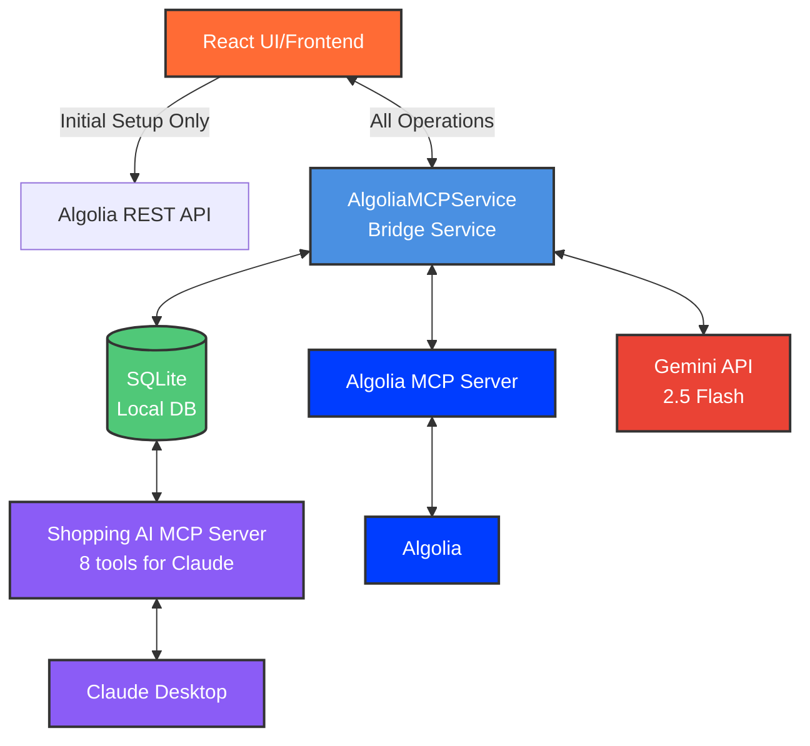

# Shopping for Algolia Personalized

*Submission for the [Algolia MCP Server Challenge](https://dev.to/challenges/algolia-2025-07-09)*

> **🔗 Algolia MCP Server Application** - All search operations use the official [Algolia MCP Server](https://github.com/algolia/mcp-node) via Model Context Protocol.

AI-powered shopping assistant with image search, ML personalization, and Claude Desktop integration.

## Demo

📹 **Demo Video**: *Coming Soon*

**Key Features:**
- AI image analysis with Gemini 2.5 Flash
- ML-powered personalization
- Claude Desktop MCP integration
- Multi-index Algolia search via MCP

## Features

- 🔗 **Algolia MCP Server**: All search operations via MCP protocol
- 🤖 **AI Image Search**: Gemini 2.5 Flash for product recognition
- 🧠 **ML Personalization**: Category and brand learning
- 📊 **8 MCP Tools**: Full suite for Claude Desktop integration
- 🎨 **Modern UI**: React + TypeScript with dark mode
- 🔒 **Secure Storage**: OS keychain for API credentials

## Architecture



### Integration Strategy

- **Initial Setup**: Direct Algolia API for index creation and data upload (one-time)
- **All Operations**: Algolia MCP Server for searches, settings, and updates
- **Personalization**: Local SQLite + custom MCP tools for Claude Desktop

## Tech Stack

- **Frontend**: React 18.3 + TypeScript + Tailwind CSS + Vite
- **Backend**: Electron 37.2 + SQLite + Node.js
- **AI/MCP**: Algolia MCP Server + Gemini 2.5 Flash + MCP SDK
- **Security**: keytar (OS keychain) + Context Isolation

## How I Used Algolia MCP Server

### 1. **All Search Operations via MCP**
```typescript
// Every search goes through Algolia MCP Server
await mcpClient.searchSingleIndex({
  indexName: 'fashion',
  query: userQuery,
  hitsPerPage: 20
});
```

### 2. **Dual MCP Architecture**
- **Algolia MCP Server**: Official server for all Algolia operations
- **Shopping AI MCP Server**: 8 custom tools for Claude Desktop

### 3. **Claude Desktop Setup**

1. Install the app or use `.dxt` file from [Releases](https://github.com/goodaymmm/shopping-for-algolia-personalized/releases)

2. Add to Claude Desktop config:
   - Windows: `%APPDATA%\Claude\claude_desktop_config.json`
   - macOS: `~/.config/Claude/claude_desktop_config.json`

   ```json
   {
     "mcpServers": {
       "shopping-ai": {
         "command": "C:\\Program Files\\Shopping for Algolia Personalized\\resources\\app\\mcp-server.bat"
       }
     }
   }
   ```

3. Restart Claude Desktop

4. **Available Tools** (8 total):
   - `get_personalization_summary` - Shopping profile overview
   - `get_user_preferences` - Category and brand preferences
   - `get_saved_products` - All saved products with details
   - `get_shopping_insights` - Comprehensive analysis
   - `get_product_comparisons` - Compare by category
   - `get_interaction_analytics` - Engagement metrics
   - `suggest_products` - AI recommendations
   - `search_products` - Product search (placeholder)

5. **Example Prompts**:
   - "Show me my shopping trends"
   - "Compare my saved products"
   - "Create a shopping analysis report"

## Quick Start

1. **Install**: Download from [Releases](https://github.com/goodaymmm/shopping-for-algolia-personalized/releases)
2. **Configure API Keys**: Settings → API Keys
   - Algolia: App ID, Search Key, Write Key
   - Gemini: API Key
3. **Search**: Upload image or type query
4. **Personalize**: Click/save products to train ML
## Installation

1. Download from [Releases](https://github.com/goodaymmm/shopping-for-algolia-personalized/releases)
2. Run installer
3. Configure API keys in Settings

## Development

### Building from Source
```bash
git clone https://github.com/goodaymmm/shopping-for-algolia-personalized.git
cd shopping-for-algolia-personalized
npm install
npm run build:dev
npm run electron:dev
```

### Creating Release with GitHub CLI
```bash
# Create release and upload files
gh release create v1.0.0 ./release/*.exe ./release/*.dxt \
  --title "v1.0.0" \
  --notes "Release notes here"

# Upload additional files to existing release
gh release upload v1.0.0 ./release/new-file.zip
```

## Platform Support

- **Windows**: ✅ Fully tested
- **macOS**: ⚠️ Build provided but untested
- **Linux**: 🔧 AppImage available

## License

This project is licensed under the MIT License - see the [LICENSE](LICENSE) file for details.

### Additional Licenses & Acknowledgments

**Dependencies:**
- React, TypeScript, Electron: MIT License
- Algolia JavaScript Client: MIT License
- Google Generative AI SDK: Apache 2.0 License
- Lucide React: ISC License

**Dataset:**
- Amazon Reviews 2023 (McAuley Lab, UCSD): Used for research and educational purposes only
- No commercial redistribution or resale of original dataset

**Third-party Services:**
- Algolia Search API: Subject to Algolia Terms of Service
- Google Gemini API: Subject to Google AI Terms of Service

**Disclaimer:** This project is created for educational and research purposes as part of the Algolia MCP Server Challenge. Not intended for commercial use.